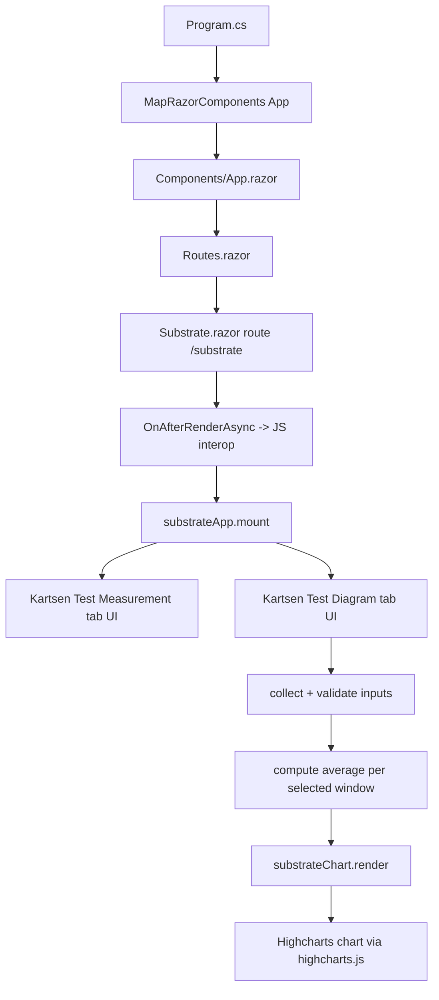

# File Functionality and Connections

This document gives the **main functionality** of each important file and explains how files are connected in runtime flow.

## 1) Root-level files

- `README.md`  
  Main project guide (run steps, architecture summary, flow, behavior).

- `.gitignore`  
  Excludes generated and local machine artifacts like `bin/`, `obj/`, `.DS_Store`.

- `FILE_FUNCTIONALITY_AND_CONNECTIONS.md`  
  This file: focused file-by-file map and connection details.

## 2) Project root (`YugaSubstrate/`)

- `YugaSubstrate.csproj`  
  Declares this as an ASP.NET Core Web project targeting `.NET 9`.

- `Program.cs`  
  App startup and hosting pipeline:
  - registers Razor components + interactive server support
  - maps static assets
  - maps root Razor app (`App`) with interactive server render mode
  - starts app (`app.Run()`).

- `appsettings.json` / `appsettings.Development.json`  
  Environment-specific app configuration (logging and framework defaults).

- `Properties/launchSettings.json`  
  Local launch profiles used by `dotnet run` / IDE debug run.

## 3) Components layer (`YugaSubstrate/Components`)

- `App.razor`  
  Root HTML shell for the whole app.  
  Very important connection point:
  - loads CSS assets
  - renders `<Routes />`
  - loads scripts in this required order:
    1. `js/highcharts.js`
    2. `js/substrateChart.js`
    3. `js/substrateApp.js`
    4. `_framework/blazor.web.js`

- `Routes.razor`  
  Router setup. Resolves page URLs and applies `Layout.MainLayout` as default layout.

- `_Imports.razor`  
  Shared `@using` directives for all Razor components.

### Layout files (`Components/Layout`)

- `MainLayout.razor`  
  Global page frame:
  - left sidebar (`NavMenu`)
  - top bar (About link)
  - page content (`@Body`).

- `MainLayout.razor.css`  
  Layout styling for sidebar, top row, responsive behavior, and Blazor error UI.

- `NavMenu.razor`  
  Left navigation links:
  - Home (`/`)
  - Substrate chart (`/substrate`)

- `NavMenu.razor.css`  
  Sidebar visual styling + icons + mobile toggle behavior.

### Page files (`Components/Pages`)

- `Home.razor`  
  Landing page with quick explanation and CTA link to `/substrate`.

- `Substrate.razor`  
  **Interop host page** for the Kartsen workflow:
  - route: `/substrate`
  - uses `InteractiveServerRenderMode(prerender: false)`
  - contains host div `#substrate-app-host`
  - on first render calls JS: `substrateApp.mount("substrate-app-host")`
  - on dispose calls JS: `substrateApp.unmount()`.

- `Error.razor`  
  Error display page for unhandled server/request exceptions.

## 4) Models (`YugaSubstrate/Models`)

- `SubstrateModels.cs`  
  C# reference list of supported time windows (`10 min`, `30 min`, ..., `1 day`).  
  Note: current UI logic reads windows from JS (`WINDOWS` in `substrateApp.js`), so keep this file synchronized for consistency.

## 5) Static assets (`YugaSubstrate/wwwroot`)

- `app.css`  
  Global CSS and substrate page shell styles (olive outer wrapper and intro styles).

- `favicon.png`  
  Browser tab icon.

- `js/highcharts.js`  
  Local Highcharts library bundle (third-party engine).

- `js/substrateChart.js`  
  Chart adapter module:
  - exports global `window.substrateChart`
  - `render(containerId, payload)` builds green-themed Highcharts column chart
  - `destroy()` clears existing chart instance.

- `js/substrateApp.js`  
  Main UI module for Kartsen tabs:
  - creates olive-themed tab interface dynamically
  - tab 1: **Kartsen Test Measurement** (checkbox + measurement1/2 inputs)
  - tab 2: **Kartsen Test Diagram** (chart pane)
  - when tab 2 is selected, collects and validates values, computes per-window average, and calls `substrateChart.render(...)`.

- `lib/bootstrap/*`  
  Bootstrap vendor assets used by default layout and typography utilities.

## 6) Runtime connections (how files call each other)

### Script dependency chain

1. `highcharts.js` provides global `Highcharts`.
2. `substrateChart.js` depends on `Highcharts` and exposes `window.substrateChart`.
3. `substrateApp.js` depends on `window.substrateChart` and exposes `window.substrateApp`.
4. `Substrate.razor` invokes `substrateApp.mount/unmount` via Blazor JS interop.

## 7) Data flow (from user input to chart)

1. User checks one or more windows in **Kartsen Test Measurement** tab.
2. User enters `Measurement 1` and `Measurement 2` (ml) for each checked window.
3. User switches to **Kartsen Test Diagram** tab.
4. `substrateApp.js`:
   - reads selected windows and numeric values
   - computes average for each selected window: `(m1 + m2) / 2`
   - builds payload `{ categories, values, title, subtitle }`
5. Payload goes to `substrateChart.render(...)`.
6. `substrateChart.js` builds Highcharts options and renders olive/green column chart.

## 8) Build/generated folders (not business logic)

- `bin/`  
  Compiled output.

- `obj/`  
  Intermediate build files, generated static web asset manifests, and caches.

These are generated automatically and should not be manually edited.
