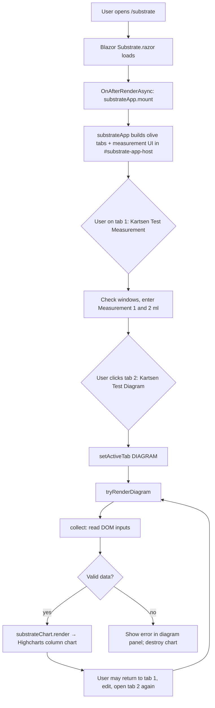

# yuga_sub

Blazor (.NET 9) **YugaSubstrate** app: one substrate, **Kartsen Test Measurement** / **Kartsen Test Diagram** tabs (olive UI), **Highcharts** green bar chart when you open the diagram tab.

## Run

```bash
cd YugaSubstrate
dotnet run
```

Open **Substrate chart** → `/substrate`.

---

## Folder structure (what lives where)

```text
yuga_sub/
├── README.md                      ← This file (repo root)
└── YugaSubstrate/                 ← ASP.NET Core / Blazor project
    ├── YugaSubstrate.csproj       ← Project file (SDK Web, net9.0)
    ├── Program.cs                 ← App entry: services, middleware, Razor mapping
    ├── appsettings*.json          ← Configuration (logging, optional settings)
    ├── Properties/
    │   └── launchSettings.json    ← `dotnet run` URLs, IIS Express profiles
    ├── Models/
    │   └── SubstrateModels.cs     ← C# list of window labels (mirror of JS WINDOWS)
    ├── Components/
    │   ├── App.razor              ← Root HTML document, script order, static assets
    │   ├── Routes.razor           ← Router → pages + MainLayout
    │   ├── _Imports.razor         ← Global `@using` for Razor components
    │   ├── Layout/
    │   │   ├── MainLayout.razor   ← Shell: sidebar + main content
    │   │   ├── MainLayout.razor.css
    │   │   ├── NavMenu.razor      ← Links: Home, Substrate chart
    │   │   └── NavMenu.razor.css
    │   └── Pages/
    │       ├── Home.razor         ← `/` landing
    │       ├── Substrate.razor    ← `/substrate` → mounts JS UI
    │       └── Error.razor        ← Error UI
    └── wwwroot/                   ← Public static files
        ├── app.css                ← Global + substrate page olive wrapper styles
        ├── favicon.png
        ├── js/
        │   ├── highcharts.js      ← Highcharts library (local bundle)
        │   ├── substrateChart.js  ← `substrateChart.render` / `destroy` (green theme)
        │   └── substrateApp.js    ← Tabs, measurements, calls chart on Diagram tab
        └── lib/bootstrap/         ← Template CSS/JS (layout chrome)
```

Build outputs (`bin/`, `obj/`) are generated; `.gitignore` excludes them.

---

## Code purpose (short)

| Piece | Purpose |
|--------|--------|
| **Program.cs** | Registers Razor Components + **Interactive Server** render mode; maps endpoints and static assets. |
| **App.razor** | HTML shell: Bootstrap + `app.css`, **script order** `highcharts.js` → `substrateChart.js` → `substrateApp.js` → `blazor.web.js`. |
| **Routes.razor** | Wires Blazor router to pages under `Components/Pages`. |
| **MainLayout / NavMenu** | Site chrome and navigation to `/` and `/substrate`. |
| **Home.razor** | Entry page with link to the substrate workflow. |
| **Substrate.razor** | Empty host `div#substrate-app-host`; on first interactive render calls **`substrateApp.mount`**; on dispose calls **`substrateApp.unmount`**. Uses `InteractiveServerRenderMode(prerender: false)` so JS interop is not blocked by prerender. |
| **substrateApp.js** | **All Kartsen UI**: olive theme, **tab 1** “Kartsen Test Measurement” (substrate name, checkboxes, two ml fields per window, clear), **tab 2** “Kartsen Test Diagram” (chart area). **Selecting tab 2** runs `collect()` + `substrateChart.render` (no generate button). |
| **substrateChart.js** | Creates/destroys one Highcharts **column** chart: categories = selected windows, values = average of measurement 1 & 2; **green gradient** bars and olive-tinted chart background. |
| **highcharts.js** | Third-party charting engine (vendored for offline/firewall-friendly use). |
| **SubstrateModels.cs** | Documents window labels in C#; logic lives in `substrateApp.js` `WINDOWS` array (keep both aligned if you add windows). |

---

## User & data flow



1. **Mount**: Blazor calls `substrateApp.mount("substrate-app-host")` → JS creates the tab bar, measurement panel, diagram panel (chart `div#substrate-chart-root`), and sets **Measurement** as the active tab.  
2. **Measure**: User selects windows (10 min … 1 day) and fills **Measurement 1** and **Measurement 2** for each checked window.  
3. **Diagram**: Clicking **Kartsen Test Diagram** hides the measurement panel, shows the diagram panel, and **`tryRenderDiagram()`** runs:  
   - **`collect()`** walks the same DOM fields, builds `categories[]` and `values[]` (each value = \((m1 + m2) / 2\)).  
   - On success → **`substrateChart.render('substrate-chart-root', payload)`** clears the chart container and draws Highcharts.  
   - On failure (nothing selected, missing numbers, etc.) → error message in the diagram panel; chart is cleared.  
4. **Re-entry**: Each time the user selects the Diagram tab again, the chart is **regenerated** from the latest inputs.  
5. **Unmount**: Leaving the page runs `substrateApp.unmount` → destroys the chart and clears the host.

---

## Behavior summary

- **Tabs**: (1) **Kartsen Test Measurement** — data entry only. (2) **Kartsen Test Diagram** — **auto-generates** Highcharts when selected.  
- **No** separate “Generate chart” button.  
- **Theme**: Olive greens for tabs/panels/inputs; **green gradient** columns and light green chart background in Highcharts.  
- **License**: Highcharts is bundled in `wwwroot/js/highcharts.js` — see [Highcharts licensing](https://www.highcharts.com/license) for production.
